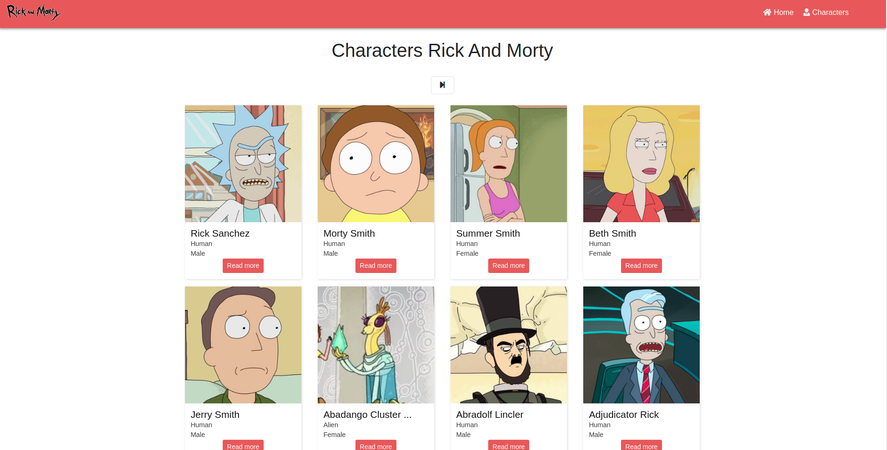
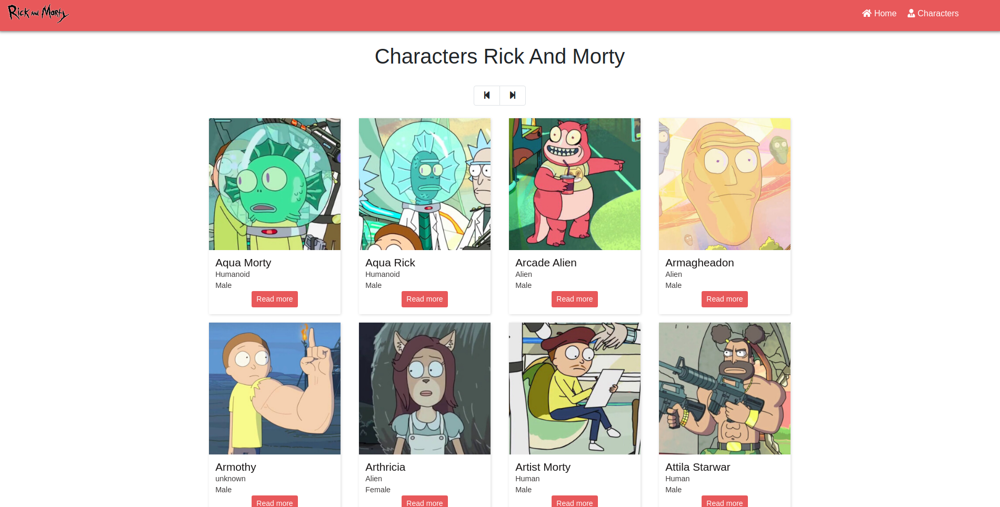

# APP RICK & MORTY WITH NETX.JS

This project is a basic next js app example.

## IMPORTANT

Required Node.js >= 12

## INSTALLATION PROCESS

* `npm install` Install project dependencies
* `npm run dev` Run development server
* `npm run build && npm start`  Run production build

## SCREENSHOTS

## LICENCE 

MIT
